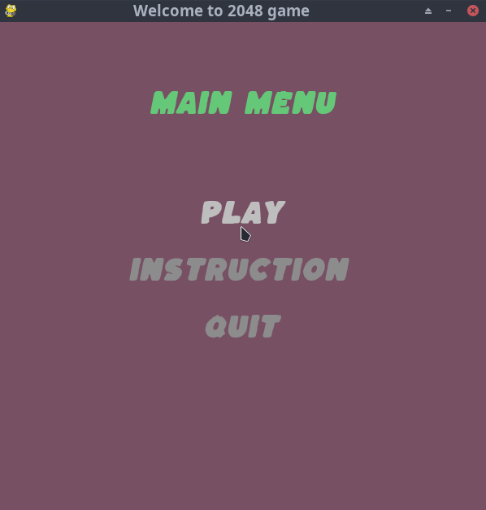
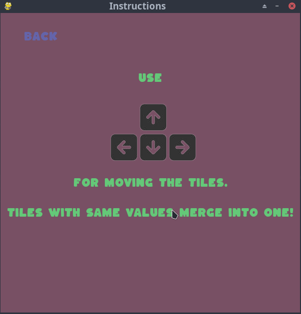
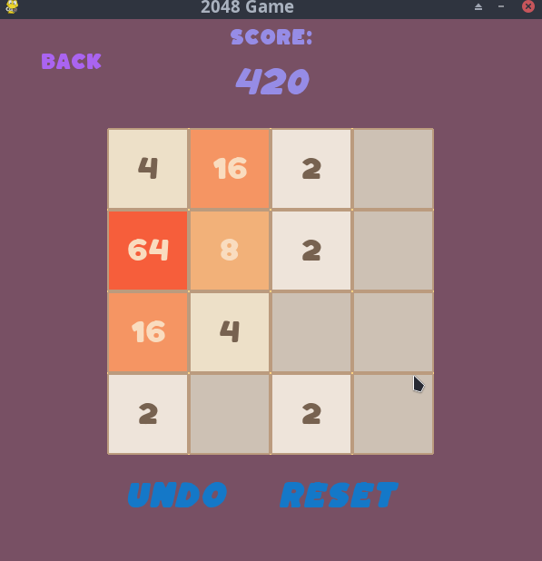
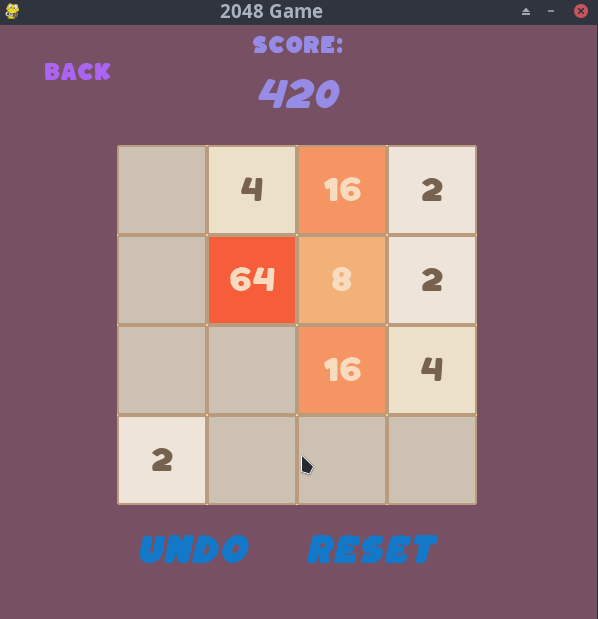
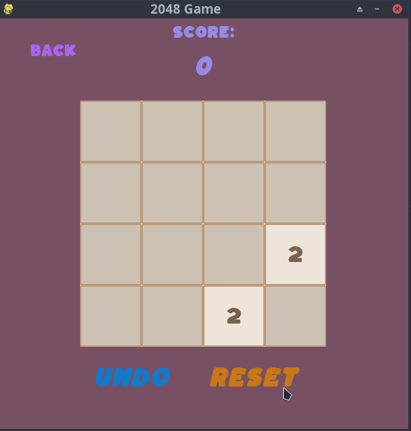
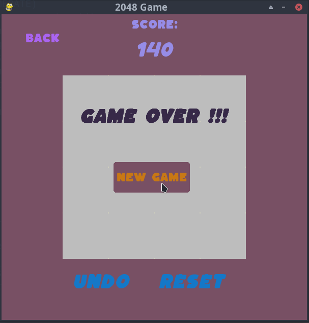

# 2048
This is the implementation of 2048 game 


<p align="center">
  
</p>

### How to Run in your Machine
```
1. Download and install python
2. Go into a folder and do:
    a.$ python -m venv env
    b.$ git clone repo_url
    c.$ source env/bin/activate (activate virtualenv -> this is on UNIX OSes)
    d.$ pip install -r ./2048/requirements.txt
    e.$ cd 2048
    e.$ python main.py
```


The different states of Game are as:

1. Main Menu

    


2. Instruction

    

3. A Game State

    

4. After Undo:

    

5. After Reset:

    

6. Game Over:

    

